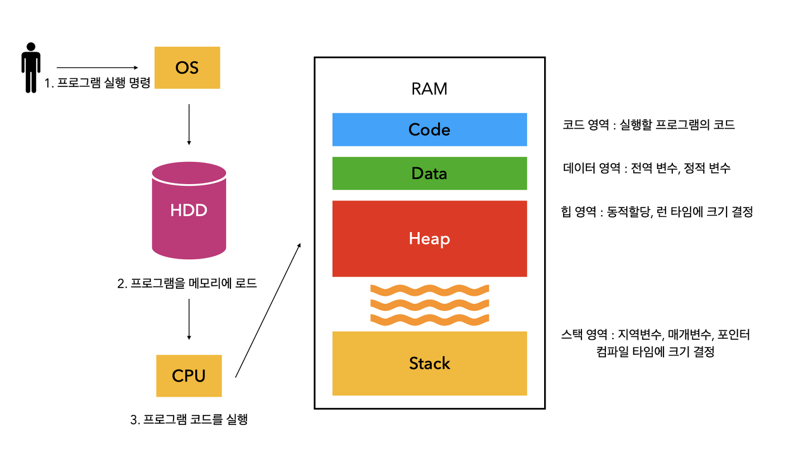
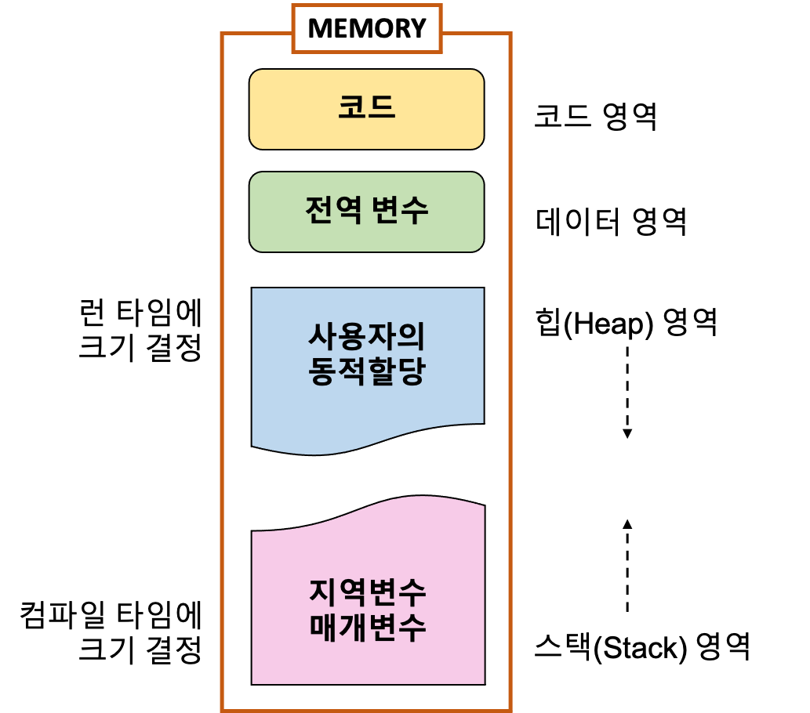

# CS Group Study (2024.06.04 화요일)

---

## Q1. 인터프리터와 컴파일러 차이점

## Q2. RAM과 ROM의 차이점

## Q3. 메인 메모리의 영역 (code, data, stack, heap) 설명하시오.

## Q4. 컴퓨터의 버스시스템과, 데이터 버스의 역할에 대해 설명하시오.

## Q5. 프로세스와 스레드의 차이점

## Q6. 캐시메모리(Cache Memory)란?

## Q7. CPU와 GPU의 차이점
