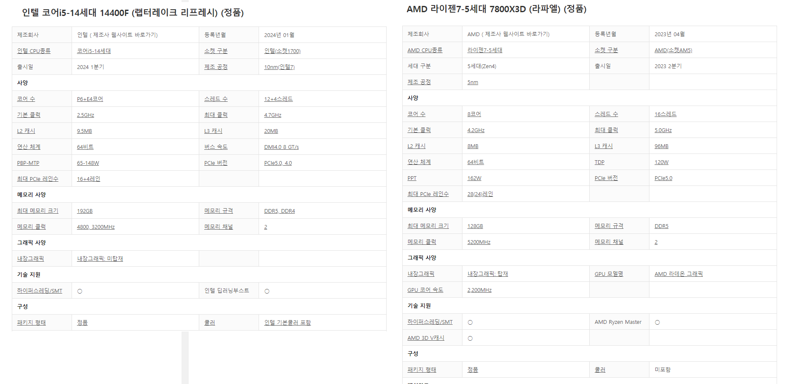

# CS Group Study (2024.06.07 금요일)

---

## 송진

-   맥 키노트 key 파일을 윈도우에서 열 수 없는 것과 윈도우 exe 파일을 맥에서 열 수 없는 것은 같은 이유일까?
-   hdd가 ssd보다 시끄러운 이유는?
-   아래 사진의 두 cpu 의 차이점은?
    

## 신혜진

-   싱글스레드는 무엇이고 어떠한 특징을 가지는가
-   싱글스레드 환경의 한계점은 무엇인가
-   자바스크립트는 왜 싱글스레드를 택했는가

## 이연지

-   ALU의 역할은 무엇인가요?
-   명령어 사이클의 주요 단계는 무엇인가요?
-   인터럽트(interrupt)는 무엇이며, 어떻게 작동하나요?

## 김동영

-   CPU의 클럭 속도란 무엇일까? 또 성능에 어떤 영향을 미칠까?
-   메모리 계층 구조란 무엇일까 왜 중요할까?
-   컴퓨터 구조에서 파이프라이닝이란 무엇인가요?
